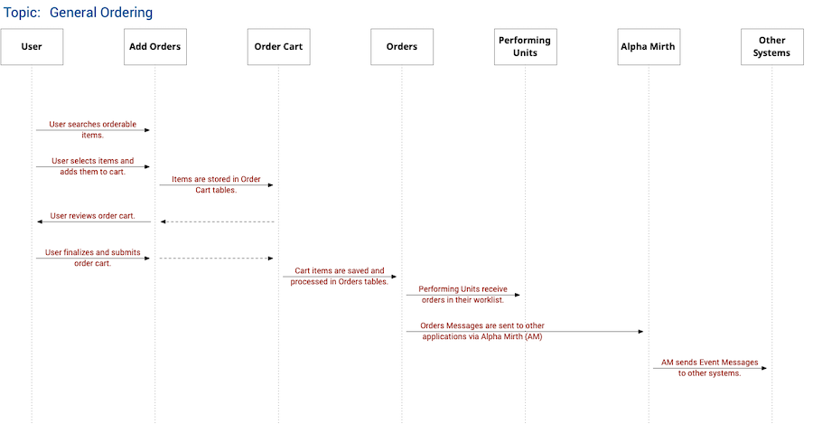

# Notes on Ordering Module

## Ordering Requirements, General Concepts and Functions

### General Ordering Module Functions

- `search_orderable_items`
- `add_to_cart`
- `edit_cart_item`
- `remove_from_cart`
- `show_cart`
- `submit_cart`
- `show_orders`
- `cancel_order`
- `request_cancel_order`
- `approve_request_cancel_order`

Ordering Module Sequence Diagram:

---

### Submit Cart to Order Transactions

- `submit_cart`: When the cart is finalized and submitted, the following ids are generated in the orders table:
  - Order Group ID (`order_group_id`): This identifies the batch from the cart.
  - Order Item ID (`order_item_id`): The primary key for each item in the transaction.
- These `ids` are important identifiers that will be passed to billing, inventory and HL7 messaging.

---

### Order Types

Each `order_item` is assigned an `order_type`. There are several **Order Types**. Depending on the `order_type`, there might be additional fields, forms validation and processing algorithms for each `order_item`.

The different Order Types for HIS Version 1 include:

- Pharmacy
- Supplies
- Laboratory
- Radiology
- Other Diagnostics
- Procedures
- Packages
- Dietary
- Consultation (Consultation/Treatment)
  - Pending clarification on additional details and charges
- Other Services
  - PT, Rehab

---

### Event Messages

These service units, modules and other systems need to be informed once an `ORDER` transaction has occured.

- **Performing Unit**: The one that needs to do the task.
  - Via **WORKLIST module**
- **Charging/Billing Module**
- **Alpha Mirth**: for events tracking and sending to other systems
- Other systems via Alpha Mirth
  - LIS
  - RIS
  - Other Ancillary IT Systems

#### Event Triggers

1. `order_submitted`: When an order is finalized and submitted
2. `order_cancelled`: When an order is cancelled, whether from Ordering Module or Charging Module.

---

### Configuration Settings

Some parameters that should be stored in a configuration file:

- `module_code`
- `module_text`
- `module_display`

---

## Database Schema/Design for Ordering Module

> Consider all these design and schemas as STRONG RECOMMENDATIONS for the actual DB design of the modules. These were designed based on specific scenarios, use cases and problems. There might be other requirements I am not aware of. Thanks!
> *--Dr. Mike Muin*

### `order_items` table

| tbl `order_items`          | Notes |
|----------------------------|---|
| `id` or `item_id`          | Primary Key. Can be called Item ID. |
| `patient_id`               | Patient Identifier |
| `visit_id`                 | Visit Identifier |
| `patient_class`            | Patient Class CODE |
| `payment_policy`           | For review. Details pending. |
| `order_group_id`           | Primary Key/ID from `order_groups` table after order is placed. |
| `item_code`                | |
| `item_description`         | |
| `item_category`            | |
| `order_type_code`          | |
| `order_type_text`          | |
| `service_section_code`     | |
| `service_section_text`     | |
| `service_department_code`  | |
| `service_department_text`  | |
| `order_quantity`           | |
| `order_priority_code`      | |
| `order_priority_text`      | |
| `order_effective_datetime` | |
| `clinical_indication`      | |
| `order_notes`              | |
| `order_status_code`        | This status handles the order cart. See below. |
| `order_status_text`        | |
| `filler_status_code`       | |
| `filler_status_text`       | |
| `payment_status_code`      | For review. Details pending. |
| `payment_status_text`      | For review. Details pending. |
| `encoded_datetime`         | |
| `encoder_user_id`          | Encoder --> User who added this to cart |
| `encoder_username`         | |
| `requesting_unit_code`     | |
| `requesting_unit_text`     | |
| `ord_md_id`                | |
| `ord_md_name`              | Full Display Name of Doctor |
| `att_md_id`                | |
| `att_md_name`              | Full Display Name of Doctor |
| Other metadata columns     | |

Related functions: All ordering process, including add to cart.

> Problem or Design Intent
> One table handles the full ordering cycle: from `add_to_cart` to `submit_order`. The process is managed by the `order_status_code`.

#### `order_status_code`, `order_status_text`

- `INC`: INCOMPLETE. (Or In Cart) This is the default status for when an item is placed in the cart.
- `DEL`: DELETED from Cart.
- `ORD`: ORDERED. Item has been ORDERED (finalized and placed). An `order_group_id` has been assigned.
- `CAN`: CANCELLED. Item was previously ordered but was cancelled.
- `COM`: COMPLETED. Completed based on final status of `filler_status_code`.

#### `filler_status_code`, `filler_status_text`

- This is dependent on order type and filler module and application.
- Default can be just 2 or 3 steps: NEW, (IN PROCESS), COMPLETED
- Samples:
  - PHARMACY: status from dispensing process
  - LAB: status from specimen, test and resulting process
  - RAD: status from procedure
  - (Future) NURSING: whether carried out or not

#### `payment_status_code`, `payment_status_text`

- Status from the HIS Billing and Cashiering Module
- Default can be just 2 steps: NEW (or UNPAID), PAID.
- Optional for now.

---

### `order_groups` table

| `order_groups` tbl                   | NOTES |
|--------------------------------------|---|
| `id` or `sys_id` or `order_group_id` | |
| `patient_id`                         | Patient Identifier |
| `visit_id`                           | Visit Identifier|
| `charge_slip_number`                 | Sent/Generated from Billing Module   |
| `order_datetime`                     | Datetime when order was finalized and entered |
| `encoder_id`                         | |
| `encoder_username`                   | |
| `payment_status_code`                | For review. Details pending. |
| `payment_status_text`                | For review. Details pending. |
| Other metadata columns               | |

Related functions: `submit_to_cart`

> Design Intent/Problem
> 
> - There is a need to track which items are ordered as a batch.
> - Billing transactions (charge slips, payments) are handled and processed in batches inside the Billing Module.
> - Only finalized and submitted items are assigned order_group_ids.
> - This process also triggers the Events process (to be discussed further).

---

### `orders_locked` table

| tbl `orders_locked` | NOTES        |
|-----------------|---|
| `id`            | PK |
| `patient_id`    | |
| `visit_id`      | |
| `is_locked`     | Default is TRUE. |

Related functions: `lock_ordering`, `unlock_ordering`

- Intent/Problem: There are situations where ordering is not allowed and is (temporarily) locked.
- These situations include:
  - Patient has outstanding balance.
  - Patient is set for discharge.
- Different modules/situations can trigger the insertion and deletion of data here.
  - Most commonly identified situation
- **IMPORTANT**: Data insertion only happens because of a trigger. There will be no default data inside. Once the lock is lifted, the row is DELETED.

How order locking check works:

- User is in Ordering Module.
- In the Add Order page, prior to searching for items, system checks if there is an entry in the orders_locked table for the patient and visit.
- If both patient_id and visit_id exists and is_locked is TRUE, system shows a message at the top of the form saying that ordering is disabled.
  - Add to Cart button (`add_to_cart`) is disabled.
  - (Optional). All search fields are disabled.

---

### `order_polling` table

> Still for review with Integration Team. *-- Dr. Mike Muin*

| tbl `orders_polling` | Notes                      |
|----------------------|----------------------------|
| `id`                 | |
| `order_group_id`     | |
| `event_trigger`      | What triggered the event
| `is_polled_01`       | Boolean. Default is FALSE. |
| `is_polled_02`       | Boolean. Default is FALSE. |
| `is_polled_03`       | Boolean. Default is FALSE. |
| `added_datetime`     | |

> Design Intent/Problem
>
> - This is for events management and polling. Will be used by Alpha Mirth to check which order groups still need to be sent out.
>   - `is_polled_01` is automatically reserved for Alpha Mirth
>   - Other event triggers or processes can use other `is_polled_` columns

---

## Pending Items for Review

### Additional Order Types

Additional Order Types can be considered for future HIS Versions:

- Pharmacy (Pharmacy may be further split into specific subtypes)
  - Drugs/Medications
  - IV Fluids
- Patient Care/Nursing Orders
- Administrative Order
- Use of Equipment
- Order Sets

> What is the difference between **Packages** and **Order Sets**?
> 
> - Packages are "financial" or "billing" grouping. Their prices may be modified/discounted based on their inclusion into the package, e.g. Wellness Package.
>	- You cannot take out an item within the packages.
> - Order Sets are commonly-ordered or related orderable items that are grouped together for convenience or for clinical relevance, e.g. clinical pathways.
>	- When they are submitted to the Order Cart, they are 'disasembled' from the set and are placed individually in the cart. This allows for deletion/removal of items from within the cart.

---

### Payment Policy Considerations for Ordering

> Everything here is for review. Not to be developed yet.

#### `FOR REVIEW` Payment First Policy

- This is a policy where a procedure, test or order is not sent to Performing Units unless payments have been made.
- Usually done in outpatient or cash-basis transactions.
- Possible behavior:
  - Items added to cart, then submitted as orders.
  - Orders are sent to charging modules for billing and payment.
  - Once payment has been made, message is sent back to Orders.
  - An event message is triggered to send to Performing Units.

#### `FOR REVIEW` Performance First Policy

- This is another policy where items are NOT charged or posted in billing unless they have been performed, e.g. X-ray was taken or lab test was done.
- Usually done for Inpatients or ER patients.
  - Some orders are submitted but not performed or carried out. Patient shouldn't pay for those.
- Possible behavior:
  - Users order procedures/supplies for patient.
  - Performing units receive orders.
  - If order is carried out, then ordering/charging module is triggerd to post charges.
  - If order is not carried out, then performing unit can cancel order prior to discharge.

---
